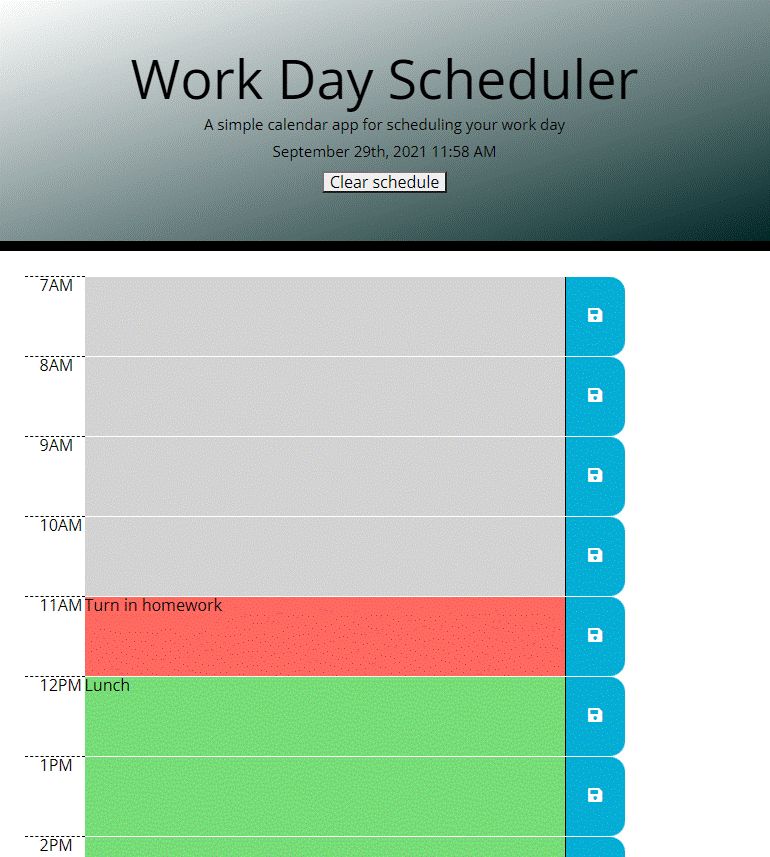

# Work Day Calendar
```
This simple calendar application allows the user to save events for each hour of the day.
It runs in the browser and features dynamically updated HTML and CSS powered by jQuery.
The [Moment.js](https://momentjs.com/) library is used to get the date and time.
```
## User Story

```
This mobile-responsive app can be extremely useful for anyone with a busy schedule.
At the beginning of the day, or the evening before,the user can very easily set up their
schedule for the day.  As the day goes along, the user can modify the plan as needed,
and even put in notes on previous hours.
Then, at the end of the day, the user can look at the schedule to review any
notes or events that were entered.
The calendar is cleared by the "Clear schedule" button so that the following day's
schedule can be entered.
```
## Features of the Daily Planner
```md
* The current date and time are displayed at the top of the calendar.

* Timeblocks are displayed for standard business hours.

* The timeblocks are color coded: gray is past, red is present, green is future.

* To enter an event, the user clicks on the main section of a timeblock according
to the intended hour.

* To save an hour's events to local storage, the user clicks on the blue
button on the right-hand side of the timeblock.

* Any time the page is refreshed, such as when the device is repowered,
all of the events are automatically reloaded from persistent local storage.

* After hours, the timeblocks are all displayed in gray, but events can be
entered for the following day.

* The schedule is easily cleared by pressing the "Clear schedule" button.
```

## Here is a screenshot of the finished app:


## Link to published app on github:
https://CChampness.github.io/WorkdayCalendar
